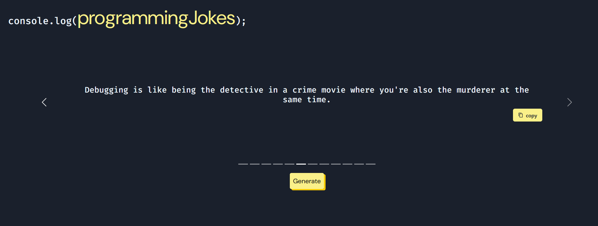

# console.log(programmingJokes)
* Do you want to impress your programmer friend with a programming joke on the fly? Well you're in luck! This programming jokes generator will allow you to generate a programming joke and easily copy it. 
* Uses [JokeAPI](https://sv443.net/jokeapi/v2/), [Axios](https://axios-http.com/docs/intro) for API fetching, [Chakra UI](https://v2.chakra-ui.com/) and [React Bootstrap](https://react-bootstrap.netlify.app/) for UI components (toast, carousel, button)
* Link to app: https://logprogrammingjokes.netlify.app/

